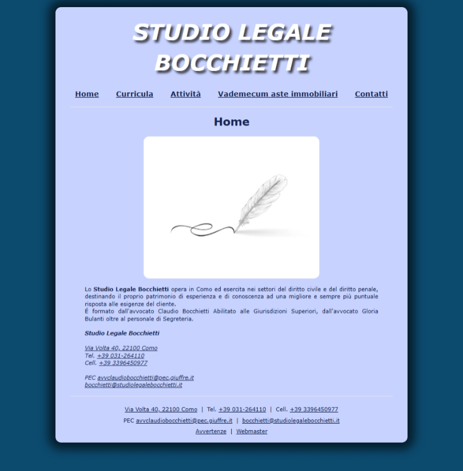

# Studio Legale Bocchietti

Official website of `Studio Legale Bocchietti`, a law firm based in Como, Italy.
Built to present the firm’s work, team, and recent publications.

## Overview

The website provides information about the firm's legal services, professional activities, contact details, and team curricula.
Additionally, it features a vademecum section that offers practical legal guidance and resources for visitors.

    
    
Homepage of Studio Legale Bocchietti

### Google Drive Integration

The website integrates with the `Google Drive API` to dynamically retrieve and display documents from remote folders.
This integration enables the firm to embed legal publications, curricula, and other documents directly on the website.
Files are fetched server-side and organized in a hierarchical structure, allowing visitors to browse and view embedded documents without manual updates to the codebase.

## Technology Stack

The website is built using `SvelteKit 5` and `Tailwind CSS` for styling.
Server-side functionality is handled by SvelteKit's server routes, which interface with the `Google Drive API` through the `googleapis` package.
The application is currently hosted on `Netlify`.

### Development and Deployment

As reported in the `package.json`, the main commands for development and deployment are:
- `npm run dev`: Starts the development server with hot-reloading.
- `npm run build`: Builds the application for production.
- `npm run preview`: Previews the production build locally.

Have a nice coding day,

Tommaso :panda_face: